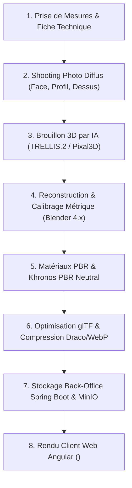

# Guide : Modèle 3D de Lunettes Fidèle au Réel (Solutions Gratuites)

*Dédié au site d'opticien Spring Boot + Angular · Mis à jour le 6 octobre 2026*

---

## 1. La vérité avant de commencer

> **Attention** : Une seule photo + IA donne une ressemblance approximative, pas un double numérique.
> L'IA invente tout ce qu'elle ne voit pas : la face arrière des branches, les charnières, l'épaisseur réelle de la monture et la courbure intérieure des verres. Elle a également tendance à déformer les proportions et à « cuire » (*bake*) les reflets ambiants directement dans la texture.

Pour obtenir un modèle 3D identique à la monture réelle, **trois éléments sont incontournables** :
1. **Les dimensions réelles** gravées ou mesurées de la monture.
2. **Des photographies de studio bien éclairées** (face, profil 90°, dessus).
3. **Une étape de reconstruction ou retouche dans Blender** (open-source & gratuit).

L'IA (génération 3D d'après image) sert uniquement de **gabarit volumétrique initial** pour accélérer le travail de départ. À titre de comparaison, les plateformes industrielles (comme Fittingbox) partent systématiquement de **deux vues de référence calibrées** (face + profil) avec des mires métriques.

---

## 2. Tableau comparatif des méthodes

| Méthode | Temps / Monture | Fidélité & Qualité | Cas d'usage recommandé |
| :--- | :--- | :--- | :--- |
| **Fichier CAD Fournisseur** | 0 min | ⭐⭐⭐⭐⭐ (Parfait) | **À demander en 1er**. Parfois sans matériaux/couleurs réels. |
| **IA seule (Image-to-3D)** | ≈ 5 min | ⭐⭐ (Aperçu rapide) | Maquettes rapides, catalogue non critique. |
| **IA + Retouche Blender** | ≈ 1 à 2 h | ⭐⭐⭐⭐ (Très bon) | **Meilleur compromis** pour démarrer rapidement. |
| **Modélisation Blender complète** | ≈ 2 à 4 h | ⭐⭐⭐⭐⭐ (Parfait) | Modèles phares, montures complexes ou haut de gamme. |

---

## 3. Étape par Étape : Du Produit Physique au Rendu Web



---

### Étape 1 — Mesurer la monture réelle (10 min)

> Les cotations exactes doivent être saisies en base de données Spring Boot pour valider l'échelle du modèle 3D.

1. **Lire le code gravé sur la branche intérieure** : Exemple `52□18-140`
   - Largeur du verre : **52 mm**
   - Largeur du pont : **18 mm**
   - Longueur de la branche : **140 mm**
2. **Mesurer au pied à coulisse** (ou règle de précision) :
   - Largeur totale de la face.
   - Hauteur maximale du verre.
   - Épaisseur du cadre et des branches.
3. **Noter les spécifications matière & verres** :
   - Matière : Acétate, Titane, Métal, Injecté.
   - Verres : Transparents, Teintés, Dégradés, Miroirs.

---

### Étape 2 — Shooting Photo Studio (30 min)

* **Éclairage** : Lumière douce et diffuse (2 softboxes ou drapeaux blancs). **Aucun reflet direct** de lampe sur les verres.
* **Fond & Angle** : Fond blanc mat. Zoom optique x2 ou x3 pour éliminer la distorsion grand-angle.
* **Vues indispensables** :
  - Face exacte (orthogonale)
  - Profil exact à 90°
  - Vue de dessus
  - Vue 3/4 à 45° (détails charnières & gravures)
* **Format** : PNG ou JPG HD (≥ 2000px), balance des blancs calée sur charte grise.

---

### Étape 3 — Génération du Brouillon IA (10 min)

1. **Détourage** : Supprimer le fond avec `rembg` (image carrée, ≥ 1024px).
2. **Génération GLB** : Utiliser **TRELLIS.2** (`microsoft/TRELLIS.2`) ou **Pixal3D** (`TencentARC/Pixal3D`).
3. **Iterations** : Générer 3 à 4 variantes et conserver le maillage le plus propre.
4. **Utilisation locale** :
   - TRELLIS.2 requiert ~24 Go de VRAM GPU.
   - Pixal3D propose le flag `--low_vram`.

---

### Étape 4 — Reconstruction & Calibrage dans Blender (1 à 3 h)

1. **Échelle métrique** : 1 unité Blender = 1 mètre. Une monture fait environ `0.14m` de large.
2. **Images de référence** : Importer les photos de face (Pavé num `1`), profil (`3`), dessus (`7`) et ajuster leur taille d'après les cotations réelles.
3. **Séparation des pièces** :
   - `frame_front` (Cadre face)
   - `temple_L` / `temple_R` (Branches)
   - `lens_L` / `lens_R` (Verres isolés avec épaisseur de 1 à 2 mm)
   - Charnières et plaquettes de nez.
4. **Validation des dimensions** : Superposer la vue 3D sur la photo avec une opacité de 50%. La tolérance doit être inférieure à **±0.5 mm**.

---

### Étape 5 — Matériaux PBR Réalistes & Standard Khronos

Dans Blender 4.2+, activer `View Transform -> Khronos PBR Neutral` pour garantir une correspondance parfaite avec le rendu du navigateur web (`<model-viewer>`).

#### Paramètres Shader Principled BSDF :

```text
• Acétate brillant :
  - Base Color: Prélevée sur photo (sans ombre ni reflet)
  - Roughness: 0.10 à 0.25
  - Coat Weight: 0.50 à 1.00

• Métal (Or / Argent / Gunmetal) :
  - Metallic: 1.00
  - Roughness: 0.20 à 0.35

• Verre Optique Transparent :
  - Transmission Weight: 1.00
  - IOR: 1.50
  - Roughness: 0.00 à 0.05

• Verre Solaire Miroir :
  - Metallic: 0.80 à 1.00
  - Roughness: 0.05
  - Base Color: Teinte miroir (Bleu, Doré, Vert)
```

---

### Étape 6 — Optimisation & Exportation glTF/GLB

* **Cibles de performance** :
  - **Triangles** : 30 000 à 60 000 max.
  - **Textures** : 2048px (ou 1024px pour mobile).
  - **Taille de fichier** : **< 5 Mo**.
* **Export Blender** : `File -> Export -> glTF 2.0 (.glb)` avec `Apply Modifiers` coché, Axe Y vers le haut, origine au centre du pont du nez.
* **Compressions CLI avec `@gltf-transform`** :

```bash
npm i -g @gltf-transform/cli
gltf-transform optimize monture.glb monture-web.glb --compress draco --texture-compress webp
```

---

### Étape 7 — Intégration dans l'Application Spring Boot + Angular

#### A. Côté Backend Spring Boot

> Ne jamais générer ou convertir le fichier 3D à la volée lors d'une requête client. Le fichier `.glb` doit être traité dans le back-office / microservice de 3D asset pipeline, puis servi de manière statique via un CDN / MinIO avec mise en cache agressive.

* **En-têtes HTTP de distribution** :
  `Cache-Control: public, max-age=31536000, immutable`
* **Entité produit Spring Boot** : Stocker les dimensions (`lensWidth`, `bridgeWidth`, `templeLength`) pour alimenter le configurateur et valider les modèles.

#### B. Côté Frontend Angular

1. **Installation** :
```bash
npm install @google/model-viewer
```

2. **Configuration du Composant Angular** :
```typescript
import { Component, CUSTOM_ELEMENTS_SCHEMA } from '@angular/core';
import '@google/model-viewer';

@Component({
  selector: 'app-product-3d-viewer',
  standalone: true,
  templateUrl: './product-3d-viewer.component.html',
  schemas: [CUSTOM_ELEMENTS_SCHEMA]
})
export class Product3dViewerComponent {}
```

3. **Template HTML (`product-3d-viewer.component.html`)** :
```html
<model-viewer
  [attr.src]="modelUrl"
  alt="Modèle 3D Monture Optique"
  camera-controls
  auto-rotate
  environment-image="neutral"
  shadow-intensity="1"
  style="width: 100%; height: 450px; background-color: #f8fafc; border-radius: 12px;">
</model-viewer>
```

---

## 4. Checklist Qualité & Pièges à Éviter

- [x] **Cotes métriques** conformes à ±0.5 mm de la monture réelle.
- [x] **Superposition 2D/3D** parfaite sur les vues de face et de profil.
- [x] **Couleurs fidèles** vérifiées sur un écran étalonné (sans filtre nuit).
- [x] **Verres transparents** sans zones noires ni reflets "peints" dans la texture.
- [x] **Rotation 360°** sans trou ni collision de géométrie.
- [x] **Poids du fichier < 5 Mo** et fluidité confirmée sur smartphone.

---
*Sources & Références : TRELLIS.2 (HuggingFace), Pixal3D (TencentARC), Model-Viewer Tone Mapping Docs, Fittingbox Digitization Workflow.*
