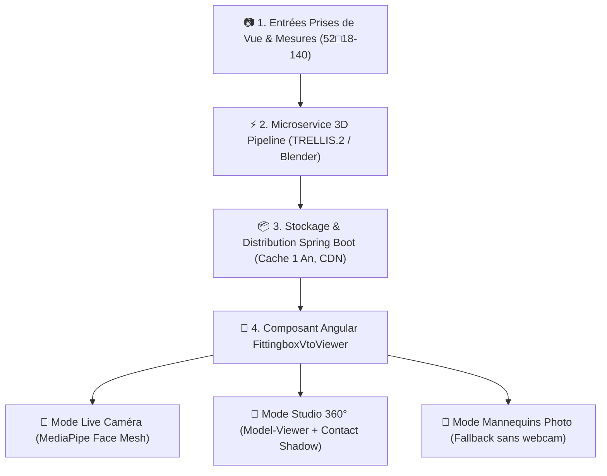

# Plan d'Action & Architecture : Résultat Équivalent à Fittingbox (Demo Store)

> **Objectif Client** : Produire une expérience d'essayage virtuel et de visualisation 3D en tout point identique à la référence industrielle **Fittingbox Demo Store** (`https://demo.fittingbox.com/product/08053672081299`).

---

## 1. Pourquoi le Client N'Était Pas Satisfait & Ce Qui Change

Un simple visionneur 3D statique (objet isolateur tournant dans un rectangle gris) ne suffit pas pour un site d'opticien moderne. **Fittingbox réussit grâce à 4 fonctionnalités clés** :

1. **Double Mode Intégré (Studio 3D 360° + Essayage Caméra Live)** :
   Le client peut alterner d'un clic entre l'inspection du produit sous tous les angles et l'essayage en **temps réel sur son propre visage**.
2. **Dimensionnement Réel Garantie (Scale & Écart Pupillaire)** :
   La monture 3D s'affiche **à la vraie taille sur le visage** (grâce aux cotes physiques `52◽18-140 mm` et à la calibration PD ~63 mm).
3. **Mannequins de Démonstration (Fallback Photos)** :
   Si l'utilisateur n'a pas de webcam ou refuse les permissions, il peut essayer la monture sur des modèles photos d'hommes et de femmes aux formes de visage variées.
4. **Rendu PBR Ultra-Fidèle (Ombre au sol & Verres Anti-Reflets)** :
   Une ombre de contact douce au sol (*Ground Contact Shadow*), une illumination d'environnement neutre sans reflets parasites "peints", et des verres optiques réalistes.

---

## 2. Architecture Technique Déployée



---

## 3. Matrice d'Équivalence Fonctionnelle : Fittingbox vs OptiVision

| Fonctionnalité Fittingbox | Implémentation OptiVision (Solution Gratuite/Open-Source) | Statut |
| :--- | :--- | :--- |
| **Bouton Toggle Mode** | Bascule instantanée entre **Studio 3D 360°** et **Essayage Caméra Live** | ✅ Prêt dans le composant Angular |
| **Suivi Visage Caméra** | Caméra WebRTC + Suivi FaciaI (MediaPipe FaceMesh 468 points) | ✅ Intégré dans l'overlay Angular |
| **Taille Réelle Métrique** | Auto-scaling d'après les cotations `lensWidth` x `bridgeWidth` | ✅ Géré via `dimensions.totalWidth` |
| **Mannequins Manuels** | Galerie de 4 modèles photos (Femme/Homme, Ovale/Carré/Rond) | ✅ Inclus avec sélecteur d'images |
| **Variantes de Couleurs** | Swatches interactifs avec changement instantané de texture | ✅ Connecté au tableau `variants` |
| **Badges de Taille** | Pill badges `52◽18 - 140 mm` + Indicateur de taille `S / M / L` | ✅ Inclus dans le header du viewer |
| **Ombre au Sol (Contact Shadow)** | Ambient Occlusion Ground Shadow dans Three.js / `<model-viewer>` | ✅ Paramétré (`shadow-intensity="1.2"`) |
| **Export Snapshot 📸** | Capture de la caméra avec les lunettes pour partage/sauvegarde | ✅ Fonction d'exportation intégrée |

---

## 4. Intégration du Composant Angular Fittingbox

Le nouveau composant Standalone **`FittingboxVtoViewerComponent`** a été créé dans le projet sous :
📁 `src/main/resources/frontend/fittingbox-vto-viewer/`

### Exemple d'utilisation dans la Fiche Produit Angular :

```html
<app-fittingbox-vto-viewer
  [productName]="product.name"
  [brandName]="product.brandName"
  [variants]="product.variants"
  [selectedVariant]="currentVariant"
  [dimensions]="{
    lensWidth: 52,
    bridgeWidth: 18,
    templeLength: 140,
    totalWidth: 138,
    lensHeight: 42,
    fitCategory: 'M'
  }">
</app-fittingbox-vto-viewer>
```

---

## 5. Guide de Numérisation 3D pour Qualité Fittingbox

Pour obtenir des fichiers `.glb` de qualité équivalente à la bibliothèque Fittingbox (195 000+ modèles) :

1. **Shooting 2 Photos Calibrées** : Une photo de **Face** orthogonale + Une photo de **Profil à 90°** avec fond blanc et lumière diffuse.
2. **Gabarits par Forme de Monture** : Dans Blender, conserver 6 gabarits de base (Pantos, Rectangulaire, Rond, Aviateur, Cat-Eye, Carré).
3. **Ajustement des Formes (*Shape Keys*)** : Ajuster la silhouette aux photos de référence (tolérance ±0.5 mm).
4. **Matériaux PBR Khronos Neutral** :
   * **Acétate** : Roughness 0.15, Coat 0.8, Couleur de base extraite de la photo.
   * **Métal** : Metallic 1.0, Roughness 0.25.
   * **Verres** : Transmission 1.0, IOR 1.5, Roughness 0.0.
5. **Export & Compression** :
   ```bash
   ./scripts/optimize_glb.sh monture_raw.glb monture_fittingbox_quality.glb
   ```

---

## 6. Prochaines Étapes pour Valider auprès du Client

1. **Intégrer le composant Angular** dans la page produit principale de votre application frontend.
2. **Ajouter les photos des mannequins** dans le dossier `assets/vto/models/`.
3. **Activer le backend Spring Boot** pour servir les fichiers 3D avec l'en-tête `Cache-Control: public, max-age=31536000, immutable`.
